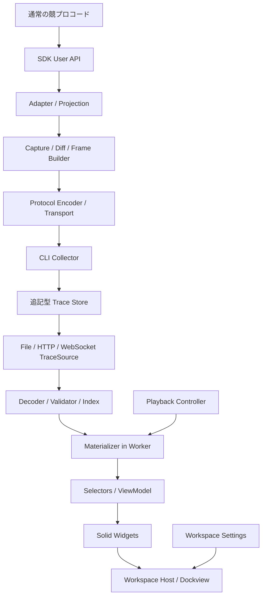

# Algorithm Visualizer 設計案

状態: 初期設計メモ。実装・公開済みAPIではない。まず [SDKとWorkspaceの体験設計](experience-design.md) を検討し、その結果を本書へ反映する。以下のProtocol案はそのための背景資料であり、確定仕様ではない。

方針更新: [Raw Traceと可視化Recipeの設計案](raw-trace-and-recipes.md)では、単一の`record!`から値・span ID配列・任意の遷移元Frame IDを送り、アルゴリズムの役割をVisualizer側のRecipeへ移す。本書のopen/close型Spanを中心にした案より新しい提案であり、未確定の事項として区別する。

前提: Rust SDKから開始する。ローカル実行・単一プロセス・単一producerをv1の対象とし、保存したtraceの再生と実行中の表示に同じ再生エンジンを使う。

## 1. 中心となる設計判断

**Entityは観測対象、Frameは原子的な表示単位、Spanは実行構造を表す。** この三つを分離し、Traceを唯一の実行履歴とする。

| 概念 | 責務 | 例 |
| --- | --- | --- |
| Entity | IDを持つ観測対象の状態 | 配列a、DP表、グラフ、変数群 |
| Frame | 複数の観測結果をまとめた、一回の表示更新 | aの更新、midの移動、探索範囲の縮小 |
| Span | 実行区間の親子関係 | solve、ループ反復、dfs(u)、再帰呼び出し |
| Decoration | 対象・位置・意味を持つ補助情報 | pointer、range、highlight、annotation |
| Widget | 状態を描画するコンポーネント | Array、Graph、Heap、Variables |
| Panel | Widgetの配置インスタンス | 同じheapを配列と木で二つ表示 |

初期判断を次に固定する。

- `view!` は呼び出し時点の値を採取する。元の参照は保存しない。
- `step!` はそれまでの採取結果をFrameとして確定する。
- ネストはSpanで表し、確定するFrameは常に平坦な列にする。
- Protocolは構造と意味を運ぶ。画面座標、DOM、Dockviewのlayoutは運ばない。
- 全履歴から任意時点の状態を復元できる。Widget自身には履歴を再生させない。
- 記録の忠実度と描画頻度を分離する。UIが遅くてもtraceのpatchを捨てない。

## 2. 全体構成と依存方向



`protocol` はSDK、Collector、再生エンジンの契約とする。MaterializerはSolid、DOM、Dockviewに依存しない純粋な状態遷移として実装する。ViewModelは表示対象と意味的な装飾を解決し、Widgetは描画とユーザー操作を担当する。

CLI Collectorは受信・基本検証・保存・配信を担当する。v1ではRust側に別のMaterializerを実装せず、TypeScriptの再生エンジンをブラウザのWorkerで動かす。これにより、CLIとUIでpatchの解釈が分岐しない。

## 3. 観測モデルと表現能力の境界

`view!("a", &a)` は専用コンテナへの変換をユーザーに要求しない。一時的に借用してProtocol値へ射影し、SDKが所有する観測結果を生成する。

ただし、次の性質は明示的な契約にする。

1. `view!` と次の `view!` の間の変更は観測できない。途中で変更して元に戻した操作も復元できない。
2. 前後の配列だけから、実際に実行されたswapや比較の列は復元できない。
3. `BinaryHeap::push` 内部のsiftを見たい場合、その内部に観測点を置ける実装が必要になる。標準コンテナの前後を採取するだけでは内部操作までは記録できない。
4. Frameの原子性は表示上の原子性である。複数の `view!` を同じCPU時刻のスナップショットにする保証ではない。
5. 同じEntityへの複数回の採取を一つのFrame内に置いた場合、中間状態は通常のTimelineの停止点にならない。途中を見せるには `step!` を挟む。

この範囲で「普通に書いたアルゴリズムへの少量の追記」を実現する。記録されていない実行をアニメーションから推測して事実として表示しない。

## 4. データモデル

### 4.1 Entityのidentity

Entityは `entityId`、`key`、表示名、`scopeId`、構造種別、値、`version` を持つ。

- `entityId` はrun内で一意なopaque string。メモリアドレスや表示名を直接使わない。
- 通常の `view!("a", &a)` はrun全体の名前空間のkey `a` にbindする。同じkeyの再採取は同じEntityを更新する。
- 再帰のローカル値は `scope: local` を指定し、`(spanId, key)` で分離する。
- 別の実体として作り直す場合は明示的に新しいhandleを作る。既存IDを削除後に再利用しない。
- Entityは最後の観測値を保持する。Rustの変数の寿命や、画面のPanelを閉じる操作とは独立する。
- `scopeId` は名前解決と表示上の所属を表す。Span終了時にも過去の状態は検索可能とし、現在のVariables表示では非activeなscopeを隠す。
- Widgetのbindingには `entityId` を使う。別runへのlayout適用時だけkeyを使って明示的に再bindする。

### 4.2 基本構造と意味情報

| 基本構造 | 最小モデル | 適用例・意味情報 |
| --- | --- | --- |
| scalar | 型付きの値 | 変数、結果、真偽値 |
| record | field名 → 値 | Variables、状態のまとまり |
| sequence | 順序付きの値 | Array、Stack、Queue、Heap |
| matrix | shapeとrow-majorの値 | DP、盤面、隣接行列 |
| graph | node ID集合とedge ID集合 | Graph、Tree、探索木 |

Queueはsequenceに `role: queue` とfront方向、Heapはsequenceに `role: heap` と順序・格納規則を与える。Treeはgraphにroot・親子方向などの意味情報を与える。同じEntityを異なるWidgetで表示できるようにする。

`Vec<Vec<T>>` のRust型だけではmatrix、隣接リスト、ragged arrayを区別できない。デフォルトではnested sequenceとし、`via: matrix()` や `via: adjacency_list()` によって意味を指定する。無理な型推論はしない。

Graphでは並行辺・自己ループ・孤立頂点を表現できる。辺のidentityを `(from, to)` だけにしない。動的グラフには安定したedge IDを要求し、静的な隣接リスト用adapterは最初の採取時にIDを割り当てる。無向隣接リストの両方向登録を勝手に重複除去しない。入力の流儀をadapterのoptionで指定する。

配列は標準では位置identityを持つ。同じ値が複数ある場合の要素追跡は保証しない。要素ID付きprojectionを選べば、挿入・移動を通じた同一要素の追跡ができる。

Rustの `BinaryHeap::as_slice()` は内部vectorへの読み取り用sliceを提供する。Heap adapterは格納順を保持し、priority orderや内部の入れ替え手順と混同しない。独自の比較順序はmetadataで明示する。[Rust BinaryHeap](https://doc.rust-lang.org/std/collections/struct.BinaryHeap.html#method.as_slice)

### 4.3 値のwire表現

v1はJSONを使うが、アルゴリズムの整数値を無条件にJSON numberへ変換しない。

```typescript
type Value =
  | { t: "null" }
  | { t: "bool"; v: boolean }
  | { t: "string"; v: string }
  | { t: "int"; v: string }
  | { t: "float"; v: string }
  | { t: "list"; v: Value[] }
  | { t: "record"; v: Record<string, Value> };
```

整数はcanonicalな十進文字列、floatはround-trip可能な文字列表現と `nan` / `+inf` / `-inf` を使う。`-0` はfloatとして保持する。欠損値とnullは区別する。SDK間で同じ値になるように正規化規則をschema仕様とfixtureに含める。

`seq` と `version` は非負u64の十進文字列とし、比較時にはBigIntなどにdecodeする。IDは文字列、配列index・matrixのshapeは安全な非負JSON整数とする。`seq` の辞書順比較は禁止する。巨大整数をnumberに丸めない設計は、JSONの一般的な数値相互運用範囲を踏まえる。[RFC 8259 §6](https://www.rfc-editor.org/rfc/rfc8259.html#section-6)

### 4.4 Decorationと参照

Decorationは `id`、対象Entity、selector、意味的なrole、任意のlabelを持つ。

| selector | 例 |
| --- | --- |
| index / boundary | a[3]、aの末尾境界n |
| range | 半開区間 `[l, r)` |
| cell / rect | dp[i][j]、DP表の矩形 |
| node / edge | IDによるグラフ要素参照 |
| field / entity | 変数のfield、Entity全体 |

SDKの `mark!("mid", mid)` は対象なしなら名前付きscalarの観測として扱う。配列上のpointerには `on: "a"` またはEntity handleを明示する。「直前にviewした対象」への暗黙依存を作らない。

v1のDecorationの寿命はFrame一つに固定する。次のFrameで再指定されなければ消える。永続的なvisitedや確定済み領域はEntityの値で持ち、ViewModelから装飾を導出する。後からpersistent decorationを追加する際には、set/removeとscopeの寿命を別capabilityとして定義する。

半開区間の空区間、`r == len`、二分探索の番兵位置は表現できる。配列要素selectorと境界selectorを区別する。範囲外の参照は「対象なし」として表示し、値をクランプして別の要素を指させない。patchの範囲違反はこれとは別にProtocolエラーとする。

## 5. Trace Protocol v1

### 5.1 Envelopeとイベント

```typescript
type Envelope<T> = {
  runId: string;
  seq: string;             // run内で0から連続するu64
  event: T;
  timeNs?: string;         // producer起点の単調時間。順序はseqで決める
  source?: {
    fileId: string;
    line: number;
    column?: number;
  };
};
```

| event.type | 責務 |
| --- | --- |
| run.start | Protocol version、producer、requiredCapabilities |
| span.open | spanId、parentId、label |
| span.close | spanId、status |
| frame | label、spanId、状態更新ops、decorations |
| log | level、text、spanId、任意のEntity参照 |
| run.end | complete / truncated / failed、理由 |

全イベントにseqを持たせる。Frame内のopsはイベントではなく、そのFrameに含まれる順序付き操作とする。別のseqは付けない。Frame IDにはframeイベントのseqを使い、UI上の「第何stepか」はframe indexから導出する。

`run.start` はseq 0で、run内に一つだけ存在する。v1ではSDKが単独でseqを発行する。Collectorがstdoutやプロセス終了情報を別のproducerとして同じ列に挿入することはしない。

### 5.2 Frameの原子性

Frame一つを一つのJSONL recordにする。JSONのdecode、全opsの検証、候補状態への適用に成功してから一括公開する。一つでも不正なら、そのFrame全体を公開しない。

```json
{
  "runId": "example",
  "seq": "7",
  "event": {
    "type": "frame",
    "label": "relax",
    "spanId": "dfs-2",
    "ops": [
      {
        "op": "entity.patch",
        "entityId": "dist",
        "baseVersion": "1",
        "version": "2",
        "changes": [
          { "op": "sequence.set", "index": 3, "value": { "t": "int", "v": "5" } }
        ]
      }
    ],
    "decorations": [
      { "id": "updated", "kind": "highlight", "entityId": "dist", "selector": { "type": "index", "index": 3 }, "role": "updated" }
    ]
  }
}
```

この例はdistとspanが既に存在する前提の一イベントである。開始から終了までの完全なtrace fixtureは、SDKの記述体験を確定してから作成する。

表示の一貫性を守るため、大きいFrameも受信途中では公開しない。recordサイズの上限は受信時に検証する。将来のchunk転送でも、転送chunkとFrameのcommitを分離する。

### 5.3 snapshotとpatch

`entity.snapshot` は一つのEntityの完全な状態であり、run全体のcheckpointとは区別する。

- 最初のsnapshotはdescriptorと `version: "1"` を持つ。
- 以後のsnapshotとpatchは `baseVersion` を持ち、versionを一つ進める。
- descriptorの構造種別は同じEntity内で固定する。意味が変わるなら新しいEntityにする。
- patchは現在のversionとbaseVersionが一致するときだけ適用する。
- 差分が大きければpatchの代わりにsnapshotを送ってよい。結果の状態は一致させる。
- 未変更の再採取はopsを生成しなくてよい。ただし `step!` が指定したFrame自体は残す。

| 操作 | 意味 |
| --- | --- |
| scalar.set | scalarを置き換える |
| record.set / record.remove | field単位の更新 |
| sequence.set / sequence.splice | 位置単位の更新、挿入・削除 |
| matrix.set | cellの更新。shape変更はsnapshot |
| graph.node.put / graph.node.remove | node IDに対する追加・更新・削除 |
| graph.edge.put / graph.edge.remove | edge IDに対する追加・更新・削除 |
| entity.remove | Entityの削除。IDは再利用しない |

opsとchangesは記載順に適用する。spliceのindexはその操作の直前の状態を基準にする。グラフは辺を削除してから頂点を削除し、頂点を追加してから辺を追加する。node.removeによる暗黙の辺削除はしない。全Frame成功まで外部には見せない。

v1は構造別patchを採用する。任意JSON pathだけに依存すると、グラフのidentity、配列挿入、schema変更の意味を安定させにくい。逆patchはwireの必須項目にしない。

### 5.4 ネストと整合性

v1は一つのactive span stackを持つ。span.openは現在のactive spanをparentとし、span.closeは最内側のspanを閉じる。FrameのspanIdはcommit時のactive span、なければnullとする。

```text
solve                         span
├─ initialize                 frame
├─ for i=0                    span
│  ├─ candidate               frame
│  └─ dfs(3)                  span
│     ├─ enter                frame
│     ├─ dfs(5)               span
│     │  └─ update            frame
│     └─ return               frame
└─ result                     frame
```

UI上で「ネストしたstep」を作るときは、そのstepをSpanにし、子にFrameを置く。親Frameの未確定transactionを保持したまま子Frameをcommitする仕様にはしない。子で確定した共有Entityへの更新は、親に戻っても継続する。

構造のindexと状態再生を分ける。Timelineは読み込み済みの将来のspan.closeを知っていてよいが、Variablesや装飾の表示に使うscopeはcursor時点のものに限る。

### 5.5 中断・version互換性

末尾が不完全なJSONL recordなら、直前の完全で有効なrecordまでを再生可能なprefixとする。途中の破損、seq欠落、version不一致はそこで停止し、後続patchへ飛ばさない。未知の状態変更イベントを黙って無視しない。

`run.end` がないファイルは正常完了とみなさない。ライブ接続中は記録中、EOFかつproducer消失なら中断として扱う。開いたままのSpanはincompleteと表示する。

Protocol versionはmajor/minorを持つ。非互換変更はmajor、追加機能はrequiredCapabilitiesで事前判定する。無視可能なpresentation hintはschemaで明示する。v1の正規仕様はJSON Schemaと本書の意味論、共通fixtureで固定する。
